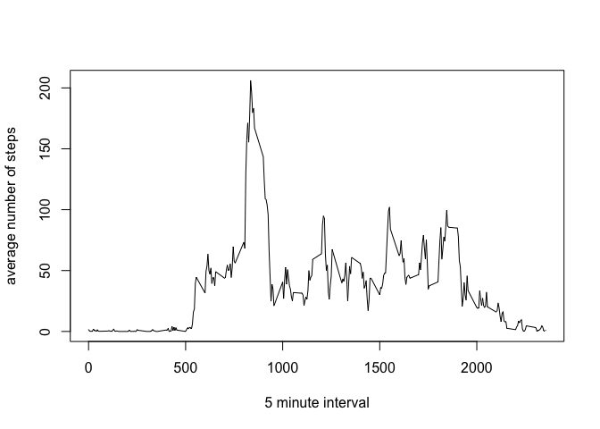

# Reproducible Research: Peer Assessment 1

---  
author: "Jon Jones"  
date: "January 5, 2016"  
output: html_document  
---  

## Loading and preprocessing the data  
This section will set the working directory  
Read the csv file into a data frame  
Transform the date column to a date type  
Finally install dplyr and ggplot2 packages for use later  

```r
setwd('/Users/jonporterjones/Coursera/ReproducibleResearch/AssignmentI/Repo/RepData_PeerAssessment1')
SourceData=read.csv('activity.csv')
SourceData$date=as.Date(SourceData$date)
install.packages("dplyr", repos="http://cran.rstudio.com/") 
```

```
## 
## The downloaded binary packages are in
## 	/var/folders/8r/hlflpx4n7817hg42wwdjks3w0000gn/T//RtmpKmJacf/downloaded_packages
```

```r
library(dplyr)
```

```
## Warning: package 'dplyr' was built under R version 3.1.2
```

```
## 
## Attaching package: 'dplyr'
## 
## The following object is masked from 'package:stats':
## 
##     filter
## 
## The following objects are masked from 'package:base':
## 
##     intersect, setdiff, setequal, union
```

```r
install.packages("ggplot2", repos="http://cran.rstudio.com/") 
```

```
## 
##   There is a binary version available (and will be installed) but
##   the source version is later:
##         binary source
## ggplot2  1.0.1  2.0.0
## 
## 
## The downloaded binary packages are in
## 	/var/folders/8r/hlflpx4n7817hg42wwdjks3w0000gn/T//RtmpKmJacf/downloaded_packages
```

```r
library(ggplot2)
```

```
## Warning: package 'ggplot2' was built under R version 3.1.3
```

## What is mean total number of steps taken per day?
1. Make a histogram of the total number of steps taken each day
2. Calculate and report the **mean** and **median** total number of steps taken per day

```r
stepsPerDay=with(SourceData,tapply(steps,date,sum,na.rm=T))
hist(stepsPerDay)
```

 

```r
mean(stepsPerDay) 
```

```
## [1] 9354.23
```

```r
median(stepsPerDay)
```

```
## [1] 10395
```

## What is the average daily activity pattern?
1. Make a time series plot (i.e. `type = "l"`) of the 5-minute interval (x-axis) and the average number of steps taken, averaged across all days (y-axis)
2. Which 5-minute interval, on average across all the days in the dataset, contains the maximum number of steps?  
**Comments**
- first use tapply to group source data by interval and get the mean of steps
- The result of this is an array, force this to a dataframe by converting the interval back to an integer and coercing the array containing the averages into a vector
- then create the plot using the data frame.
- the last line will give you the row from the data frame containing the highest average.  It is ** Interval 835 ** and this is consistent with our plot

```r
AverageByInterval=with(SourceData,tapply(steps,interval,mean,na.rm=T)) 
AverageByIntervalFrame = data.frame("Interval"=as.integer(names(AverageByInterval)),"Average"=as.vector(AverageByInterval)) 
plot(AverageByIntervalFrame$Interval,AverageByIntervalFrame$Average,type="l",xlab="5 minute interval",ylab="average number of steps")
```

 

```r
AverageByIntervalFrame[AverageByIntervalFrame$Average==max(AverageByIntervalFrame$Average),] 
```

```
##     Interval  Average
## 104      835 206.1698
```

## Imputing missing values
1. Calculate and report the total number of missing values in the dataset (i.e. the total number of rows with `NA`s)
Answer: on second line - There are 2304 rows with NA values for steps.
2. Devise a strategy for filling in all of the missing values in the dataset. 
Strategy used is the mean for the 5 minute interval.
3. Create a new dataset that is equal to the original dataset but with the missing data filled in.
4. Make a histogram of the total number of steps taken each day and Calculate and report the **mean** and **median** total number of steps taken per day. Do these values differ from the estimates from the first part of the assignment? What is the impact of imputing missing data on the estimates of the total daily number of steps?  
** Answer: **  
The values do not differ by much.  The histograms look similar and the mean/median are close to one another as well.  This is because when you add an average to missing values in a data set that already contains the averages, you don't change the average by much.  The replacement values are the mean, so the mean of the whole data set does not change significantly.
** this time the comments are in the R code. **
This code gets a little complicated - probably more efficient way to do this  

```r
SourceLogical = is.na(SourceData$steps) #this creates a logical vector containing the na's
sum(SourceLogical) # There are 2304 rows with NA values for steps.
```

```
## [1] 2304
```

```r
SourceNAOnly=SourceData[SourceLogical,] # This creates a data frame only of the nulls.
#Merge data frame of averages with data frame of NA's.
SourceNAOnlyMergedWithAverage=merge(AverageByIntervalFrame,SourceNAOnly, by.x = "Interval", by.y = "interval")
# rename the columns to match the original SourceData 
names(SourceNAOnlyMergedWithAverage) = c("interval","steps","NA","date")
# drop the colum NA
SourceNAOnlyMergedWithAverage=SourceNAOnlyMergedWithAverage[,c("interval","steps","date")]
# now bind the NA's replaced wiht average with all the rows that were not NA
SourceDataBoundWithAverage=rbind(SourceNAOnlyMergedWithAverage,SourceData[!SourceLogical,])
# sum it all up, plot the 2 histograms and report the mean/median.
StepsPerDayBoundWithAverage=with(SourceDataBoundWithAverage,tapply(steps,date,sum,na.rm=T))
# Use par to display the histogram from earlier and compare to the histogram of stepsPerDateBoundWithAverage
par(mfrow=c(2,1))
hist(stepsPerDay)
hist(StepsPerDayBoundWithAverage)
```

 

```r
mean(StepsPerDayBoundWithAverage) 
```

```
## [1] 10766.19
```

```r
median(StepsPerDayBoundWithAverage)
```

```
## [1] 10766.19
```

## Are there differences in activity patterns between weekdays and weekends?
1. Create a new factor variable in the dataset with two levels -- "weekday" and "weekend" indicating whether a given date is a weekday or weekend day.
1. Make a panel plot containing a time series plot (i.e. `type = "l"`) of the 5-minute interval (x-axis) and the average number of steps taken, averaged across all weekday days or weekend days (y-axis).

```r
SourceData$daysofweek = as.factor(weekdays(SourceData$date))
weekendLogical=as.logical(SourceData$daysofweek=='Saturday') | as.logical(SourceData$daysofweek=='Sunday')
SourceData$IsWeekend=as.factor(ifelse(weekendLogical,"Weekend","Weekday"))
SourceDataGrouped=group_by(SourceData,interval, IsWeekend)  #group_by creates factor groups
SourceDataGroupedAndAveraged=summarise(SourceDataGrouped,mean(steps,na.rm=T))
names(SourceDataGroupedAndAveraged) = c("interval","IsWeekend","Average")
qplot(interval, Average, data = SourceDataGroupedAndAveraged,facets=.~IsWeekend,geom="line")
```

 
